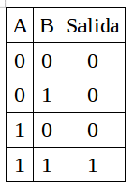
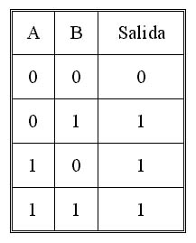
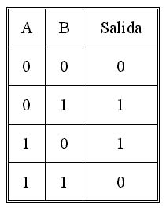
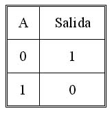
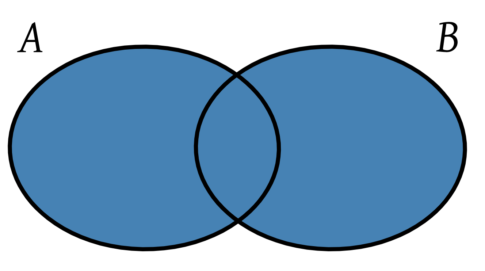
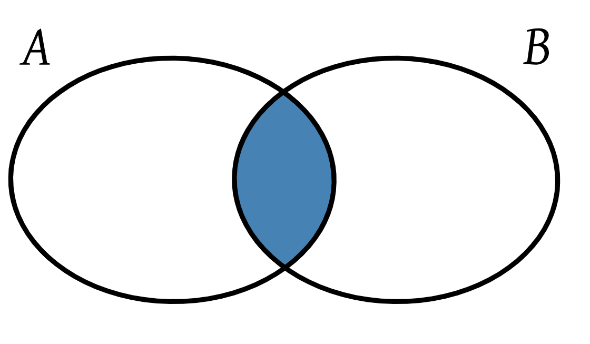

footer: © ADD Costa Tropical 2020 - Power Shell
slidenumbers: true
autoscale: true
<!-- slide-transition: true -->

## Power Shell Cap. 7

### Operadores lógicos y de tipo


---

## Capítulo anterior (6) vimos

- Operadores de comparación simples
- Operadores de comparación de cadenas
- Operadores de comparación de colecciones

---

## Índice Capítulo 7

- Lógica de circuitos y tablas de verdad
- Operadores lógicos
- Operadores de tipo de dato

---

## Lógica de circuitos y tablas de verdad

- La madre del cordero
- Bits
- Circuitos
- Microprocesadores

---

## Operadores lógicos

- -And
- -Or
- -Xor
- -Not
- Teoría de conjuntos

---

## Operador -And

- Se puede evaluar con 2 o más operandos
- Cada operando debe devolver un valor boobleano
- Devolverá Verdadero cuando todos los operandos devuelvan verdadero
- Ejemplo: Hombres rubios de más de 30 años
- Ejemplo

```powershell
Write-Host (5 -gt 1) -And (5 -lt 10)
Write-Host (5 -gt 1) -And (5 -lt 10) -And (5 -gt 10)
```

---

## Operador -And Tabla de verdad



---

## Operador -Or

- Se puede evaluar con 2 o más operandos
- Cada operando debe devolver un valor boobleano
- Devolverá Verdadero cuando al menos un operando devuelva verdadero
- Ejemplo: Hombres rubios o con más de 30 años
- Ejemplo

```powershell
Write-Host (5 -gt 1) -Or (5 -lt 1)
Write-Host (5 -gt 1) -Or (5 -lt 10) -Or (5 -gt 10)
```

---

## Operador -Or Tabla de verdad



---

## Operador -Xor

- Se puede evaluar con 2 o más operandos
- Cada operando debe devolver un valor boobleano
- Devolverá Verdadero cuando solo un operando devuelva verdadero, en el resto de casos devolverá falso
- Ejemplo: Hombres rubios o con más de 30 años pero no a la vez
- Ejemplo

```powershell
Write-Host (5 -gt 1) -Xor (5 -lt 1)
```

---

## Operador -Xor Tabla de verdad



---

## Operador -Not

- Se evalua sobre un solo operando
- Devolverá el valor booleano contrario al operando sobre el que se aplique
- Si es verdadero devolverá falso
- Si es falso devolverá verdadero

- Ejemplo

```powershell
Write-Host -Not(5 -gt 1)
```

---

## Operador -Not Tabla de verdad



---

## Teoría de conjuntos

- Se puede aplicar también a la teoría de conjuntos
- -And => Intersección
- -Or =>  Unión

---

## Teoría de conjuntos Unión (Or)



---

## Teoría de conjuntos Unión (And)



---

## ¿Para qué sirve esto?

- Toma de decisiones
- Control de flujo
- Sentencias repetitivas
- Y un sin fin de usos...

---

## Operadores de tipo de dato

- ¿Recordáis que vimos los tipos de datos que existían?
- Estos operadores nos servirán para saber si una variable es de un tipo de dato u otro

---

## Operadores de tipo de dato -is -isnot

- -Is: Comprueba si un objeto es de un cierto tipo de objeto
- -IsNot: Comprueba si un objeto no es de un cierto tipo de objeto

```
$a = "Hola"
$a -is [int]
$a -isnot [int]
```

---


# Preguntas y respuestas
No tengas miedo, es gratis :smile:

---

## ADD Costa Tropical

- https://addcostatropical.org
- Youtube => ADD Costa Tropical
- @addcostatropical
- #somosadd
- Facebook
- Instagram

---

## ADD Costa Tropical
- Investiga, aprende y comparte

## Gracias
- Un placer compartir con vosotros
