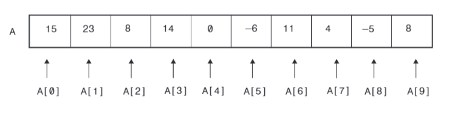

footer: © ADD Costa Tropical 2020 - Power Shell
slidenumbers: true
autoscale: true

<!-- slide-transition: true -->

## Power Shell Cap. 8

### Tipo de dato Array


---

## Capítulo anterior (7) vimos

- Lógica de circuitos y tablas de verdad
- Operadores lógicos
- Operadores de tipo de dato

---

## Índice Capítulo 8

- ¿Qué es un array?
- Definición de array's
- Generador de array con números consecutivos
- Acceso a un elemento de un array
- Métodos útiles
- Arrays multidimensionales

---

## ¿Qué es un array?

- Conjunto de espacios de memoria
- Estructura de datos para poder almacenar una colección de datos - normalmente consecutivos en memoria
- Pueden ser del mismo tipo o de diferente tipo

---

## ¿Qué es un array? II

- Imagen descriptiva de un array
- Posiciones de memoria
- Índices



---

## Usos de un array

- Conjunto de valores
- Número indeterminado de valores entrantes
- Almacenaje de cantidad de datos

---

## Definición de arrays

```
$array_vacio = @()
$enteros = @(1,2,3,4,5)
$enteros = 1,2,3,4,5
$consecutivos = 1..10
$caracteres = "a","b","c","d","e"
$multi_tipo = @(1,2,3,'a','b')
```

- Ejemplos en vivo

---

## Accediendo a los elementos de un array

- Índices numéricos

```
$array_vacio = @()
$enteros = @(1,2,3,4,5)
$enteros[0]
$enteros[2]
$enteros[5]
$enteros[-1]
```

---

## ¿Cuántos elementos tiene un array?

- Los arrays tienen métodos que nos ayudan con algunas cuestiones

```
$array_nuevo = @(1)
$array_nuevo.Length
```

---

## ¿Cómo agrego elementos?

- En PowerShell los arrays son elementos estáticos
- PowerShell no añade elementos a arrays, crea una copia del actual más el elemento que se añade

```
$numeros = @(2,3)
$numeros += 4
$numeros
$numeros += 5,6
$numeros
```

---

## ¿Cómo elimino elementos?

- PowerShell no da forma de eliminar elementos ya que los arrays son estructuras estáticas
- Para poder eliminar, deberíamos crear otro array con todos los elementos menos el que queremos eliminar

---

## ArrayList

- Para solucionarlo usaremos ArrayList
- ArrayList es como un array pero sin ser fijos

```
[System.Collections.ArrayList]$caps = "A", "B", "C", "D"
$caps.Remove("B")
```

---

## Eliminar todas las ocurrencias

- Si queremos eliminar todas las ocurrencias, usaremos Remove acompañado de un while (lo veremos más tarde) y el método `-contains`

```
[System.Collections.ArrayList]$caps = "A", "B", "C", "D", "C", "E"
while ($caps -contains "C") {
    $caps.Remove("C")
}
```

---

## Suma de arrays

- Para sumar arrays solo necesitamos utilizar el operador +
- Esto nos dará como resultado un array con la concatenación de los dos arrays

```
$a = @(2,3)
$b = @(2,3)
$c = $a+$b
```

---

## ¿Funciones útiles? -join

- Este comando es muy utilizado ya que devuelve una concatenación de todos los elementos del array unidos con el caracter que se pase

```
$numeros = @(1,2,3)
$numeros -join '-'
Imprimirá '1-2-3'
```

---

## ¿Funciones útiles? -contains

- Este comando devuelve verdadero si el array contiene el elemento que se pasa como parámetro

```
$numeros = @(1,2,3)
$numeros -contains 1
```

- Devolverá True

---

## ¿Funciones útiles? -notcontains

- Este comando devuelve lo contrario que devolvería contains. Verdadero si el array NO contiene el elemento que se pasa como parámetro o Falso en caso contrario

```
$numeros = @(1,2,3)
$numeros -notcontains 1
```

- Devolverá FALSE

---


# Preguntas y respuestas

No tengas miedo, es gratis :smile:

---

## ADD Costa Tropical

- https://addcostatropical.org
- Youtube => ADD Costa Tropical
- @addcostatropical
- #somosadd
- Facebook
- Instagram

---

## ADD Costa Tropical

- Investiga, aprende y comparte

## Gracias

- Un placer compartir con vosotros
