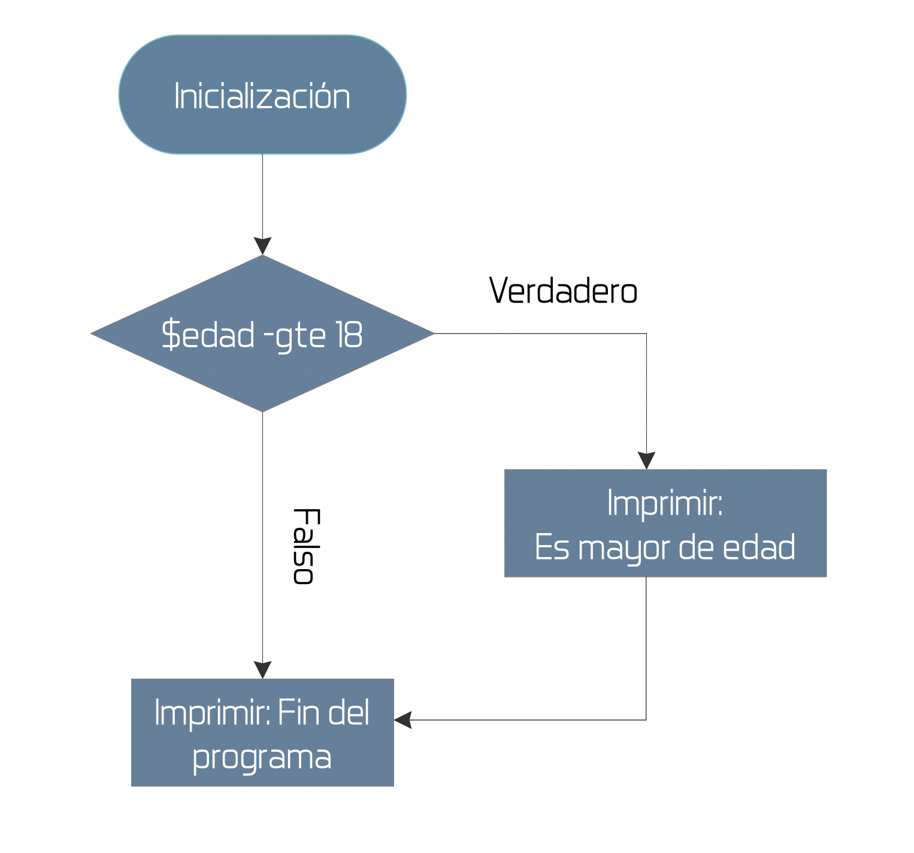
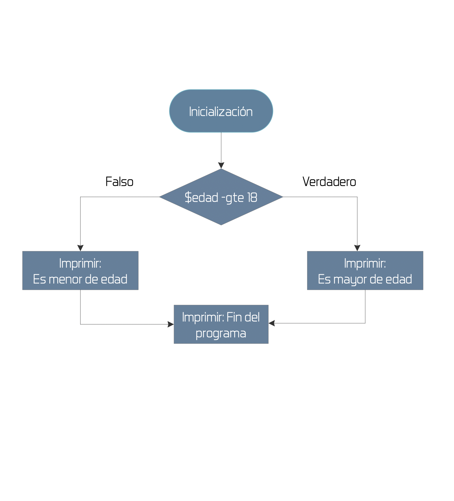
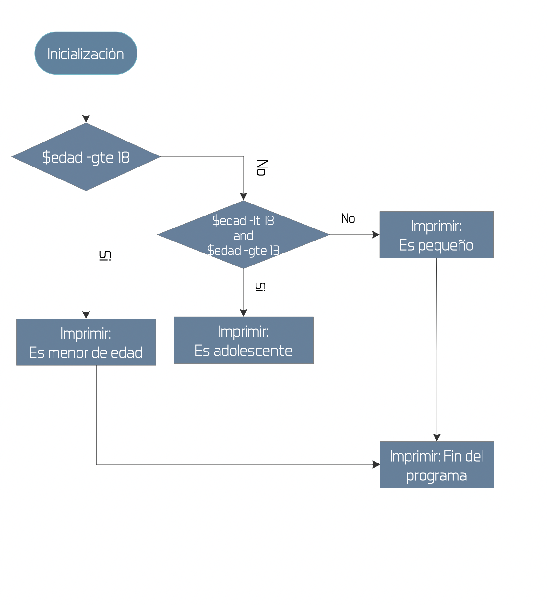

footer: © ADD Costa Tropical 2020 - Power Shell
slidenumbers: true
autoscale: true

<!-- slide-transition: true -->

## Power Shell Cap. 9

### Estructuras de control de flujo


---

## Capítulo anterior (8) vimos

- ¿Qué es un array?
- Definición de array's
- Generador de array con números consecutivos
- Acceso a un elemento de un array
- Métodos útiles
- Arrays multidimensionales

---

## Índice Capítulo 9

- Estructuras de control
- ¿Por qué son necesarias?
- Instrucción IF
- Instrucción IF - ELSE
- Instrucción IF - ELSEIF - ELSE

---

## Estructuras de control

- Necesarias 100%
- Elemento imprescindible para todo lenguaje de programación
- No inventa nada, son similares a las de todos los lenguajes de programación
- Vamos a repasarlos

---

## Instrucción IF

- Lo utilizaremos para tomar un camino u otro del flujo de control, dependiendo del valor resultante de una condición
- Para la condición podremos utilizar cualquier operador lógico de los vistos en los anteriores videos

---

## IF

```powershell
[int]$edad = Read-Host "Introduce tu edad:"
if ($edad -ge 18){
    Write-Host "Es mayor de edad"
}
Write-Host "Fin del programa"
```

- Nota que el proceso fin del programa siempre se ejecutará independientemente de la condición



---

## Instrucción IF-ELSE

- Es exactamente igual que el IF pero con flujo concreto en caso negativo
- Es decir, se ejecutará el bloque del else, si la condición devuelve Falso
- Se utilizará para caminos excluyentes

---

## IF-ELSE

```powershell
[int]$edad = Read-Host "Introduce tu edad:"
if ($edad -ge 18){
    Write-Host "Es mayor de edad"
}else{
    Write-Host "Es menor de edad"
}
Write-Host "Fin del programa"
```

- Nota que el proceso fin del programa siempre se ejecutará independientemente de la condición



---

## IF-ELSEIF-ELSE

- Lo utilizaremos cuando existan más de una condición que queramos evaluar
- Si no se cumple ninguna siembre habrá un caso por defecto



---

## IF-ELSEIF-ELSE

```powershell
[int]$edad = Read-Host "Introduce tu edad:"
if ($edad -ge 18){
    Write-Host "Es mayor de edad"
}elseif (($edad -lt 18) -And ($edad -gte 13)){
    Write-Host "Es adolescente"
}else{
    Write-Host "Todavía es pequeño"
}
Write-Host "Fin del programa"
```


---

## SWITCH al rescate

- Si tenemos múltiples condiciones que evaluar puede ser un infierno
- Sobre todo a la hora de escribir todas las condiciones y casos posibles
- Podemos evaluar casos concretos o incluso condiciones

---


# Preguntas y respuestas

No tengas miedo, es gratis :smile:

---

## ADD Costa Tropical

- https://addcostatropical.org
- Youtube => ADD Costa Tropical
- Instagram personal: @bienvenidosaez
- Instagram ADD: @addcostatropical
- #somosadd

---

## ADD Costa Tropical

- Investiga, aprende y comparte

## Gracias

- Un placer compartir con vosotros
