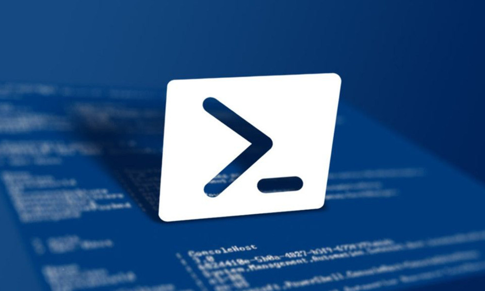

footer: © ADD Costa Tropical 2020 - Power Shell
slidenumbers: true
autoscale: true
<!-- slide-transition: true -->

## Power Shell Cap. 6

### Operadores de comparación



---

## Capítulo anterior (5) vimos

- Necesidad de operadores
- Tipos de operadores
- Operador de asignación =
- Operadores aritméticos

---

## Índice Capítulo 6

- Operadores de comparación simples
- Operadores de comparación de cadenas
- Operadores de comparación de colecciones

---

## Operadores de comparación

- ¿por qué los necesitamos?
- Operan entre variables o valores fijos
- Al ser operadores de comparación lógicos devuelven normalmente valores boobleanos, o verdadero o falso.
- Se pueden concatenar usando otros operadores lógicos (ya lo veremos)

---

## Operadores de comparación simples de igualdad

- 2 -eq 2    # Igual que (==)
- 2 -ne 4    # Desigual a (!=)
- ejemplos

---

## Operadores de comparación simples de comparación de cantidades

- 5 -gt 2    # Mayor que (>)
- 5 -ge 5    # Mayor o igual que (>=)
- 5 -lt 10   # Menor que (<)
- 5 -le 5    # Menor o igual que (<=)
- ejemplos

---

## Operadores de comparación de cadenas con comodines

- "MyString" -like "*String"
- "MyString" -notlike "Other*"

---

## Operadores de comparación de cadenas con expresiones regulares

- "MyString" -match "$String^"
- "MyString" -notmatch "$Other^"

---

## Operadores de arrays

- contains Contiene

```
1,2,3 -contains 1
```

- notcontains No contiene

```
1,2,3 -notcontains 4
```

---


# Preguntas y respuestas
No tengas miedo, es gratis :smile:

---

## ADD Costa Tropical

- https://addcostatropical.org
- Youtube => ADD Costa Tropical
- @addcostatropical
- #somosadd
- Facebook
- Instagram

---

## ADD Costa Tropical
- Investiga, aprende y comparte

## Gracias
- Un placer compartir con vosotros
