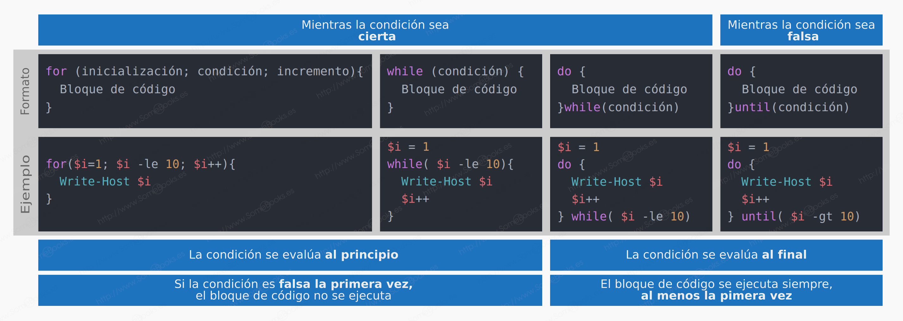

footer: © ADD Costa Tropical 2020 - Power Shell
slidenumbers: true
autoscale: true

<!-- slide-transition: true -->

## Power Shell Cap. 11

### Estructuras repetitivas


---

## Capítulo anterior (10) vimos

- Switch
- Switch - Break
- Switch - Default
- Switch con condicionales

---

## Índice Capítulo 11

- ¿Qué son?
- ¿Por qué son necesarias?
- Tipos según cuando se evalúa la condicion de parada
- Estricta relación con los arrays

---

## ¿Qué son?

- Las estructuras repetitivas son imprescindibles en todo lenguaje de programación
- Nos ayudarán a ejecutar x veces un bloque de instrucciones sin tener que repetirlo ni una sola vez
- El caso más fácil que se me ocurre
- Escribe 100 veces la palabra 'Hola'

---

## ¿Qué son? II

```powershell
Write-Host "Hola"
Write-Host "Hola"
Write-Host "Hola"
Write-Host "Hola"
Write-Host "Hola"
Write-Host "Hola"
Write-Host "Hola"
Write-Host "Hola"
...
Write-Host "Hola"
```

---

## ¿Por qué son necesarias?

- El ser humano es vago/práctico por definición
- No queremos ser monos con teclado, usemos las herramienta para ser lo más eficientes posibles

---

## ¿Son imprescindibles?

- Muchas veces no sabremos cuántas veces vamos a tener que repetir un bloque de instrucciones
- El valor de la condición de parada se establecerá en tiempo de ejecución
- Traduce...

---

## While

- Esta estructura, primero evalúa y luego ejecuta el bloque de repetición
- Lo hará hasta que deje de cumplirse

---

## While

- Se puede decir que es la estructura repetitiva más fácil de entender
- Está compuesto por dos bloques, la condición y el bloque a repetir
- Ejecutará el bloque a repetir mientras la condición se cumpla, por lo que es necesario modificar la variable de la condición para que pare en algún momento

---

## While - Ejemplo

```powershell
$veces = 0
while ($veces -lt 100) {
    Write-Host "Hola"
    $veces++
}
```

---

## While - Ejemplo infinito

```powershell
$veces = 0
while ($veces -lt 100) {
    Write-Host "Hola"
}
```

---

## Do While

- Esta estructura, al contrario que el while, primero ejecuta la instrucción y luego pregunta la condición
- Este tipo de estructura servirá para ejecutar al menos una instrucción

---

## Do While - Ejemplo

- En este ejemplo, se imprimirá lo siguiente: 0, 1, 2, 3, 4

```powershell
$i = 0
do {
    Write-Host $i
    $i++
} while ($i -lt 5)
```

---

## Foreach

- Esta estructura será utilizada para poder iterar por un array
- Él por si solo tomará en cada iteración el valor que toque del Array

---

## Foreach

- Esta estructura será utilizada para poder iterar por un array
- Él por si solo tomará en cada iteración el valor que toque del Array

---

## Foreach- Ejemplo

```powershell
$colores = @("azul", "verde", "rojo")
foreach ($c in $colores) {
    Write-Host $i
}
```

- Imprimirá: azul, verde, rojo cada color en una nueva linea

---

## Foreach- Ejemplo II

```powershell
$numeros = 1..10
foreach ($n in $numeros) {
    Write-Host $n
}
```

- Imprimirá: los números del 1 al 10 cada uno en una linea

---

## For

- For está pensada para que definamos, desde el principio, el número de repeticiones que van a llevarse a cabo.
- Incluso podremos conseguir que se comporte como una estructura while

---

## For - Tres secciones

- Inicialización: esta sección se ejecuta una sola vez. Se utiliza para determinar el valor de la variable que será utilizada para la condición posterior.
- Condición: Será la condición que evalúa antes de cada iteración para determinar si se va a ejecutar el bloque de instrucciones o no
- Incremento: será una o más instrucciones que se ejecutarán al final de cada iteración. Se utilizará para modificar la variable que se utilice para la condición

---

## For - Estructura básica

```powershell
for (inicializacion; condición; incremento) {
    Bloque de código que se ejecutará cada vez
}
```

---

## For - Ejemplo

```powershell
for ($i=0; $i -lt 10; $i++) {
    Write-Host $i
}
```

- Imprimirá: 0, 1, 2, 3, 4, 5, 6, 7, 8, 9 cada número en una línea

---

## For - Ejemplo II

```powershell
[int]$fin = Read-Host "Introduce un número"
for ($i=0; $i -lt $fin; $i++) {
    Write-Host $i
}
```

- Imprimirá todos los números desde el 0 hasta el número introducido

---

## For - Ejemplo índice para array

```powershell
$nombres = @("Motril", "Salobreña", "Lobres", "Itrabo")
for ($i=0; $i -lt $nombres.Length; $i++) {
    Write-Host $nombres[$i]
}
```

- Imprimirá todos las ciudades recorriendo el array de uno en uno

---

## Cuadro resumen (Somebooks)



---

## Cierre del curso

- Hasta aquí las estructuras repetitivas
- Hasta aquí la parte teórica del cursor
- Nos queda una parte de ejercicios prácticos en los que podremos poner en práctica casi todo lo aprendido

---


# Preguntas y respuestas

No tengas miedo, es gratis :smile:

---

## ADD Costa Tropical

- https://addcostatropical.org
- Youtube => ADD Costa Tropical
- Instagram personal: @bienvenidosaez
- Instagram ADD: @addcostatropical
- #somosadd

---

## ADD Costa Tropical

- Investiga, aprende y comparte

## Gracias

- Un placer compartir con vosotros
