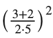

footer: © ADD Costa Tropical 2020 - Power Shell
slidenumbers: true
autoscale: true

<!-- slide-transition: true -->

## Power Shell Cap. 12

### Ejercicios: Variables


---

## Ejercicio 1

- Escribir un programa que muestre por pantalla la cadena ¡Hola Mundo!.

```powershell
Write-Host "¡Hola Mundo!"
```

---

## Ejercicio 2

Escribir un programa que almacene la cadena ¡Hola Mundo! en una variable y luego muestre por pantalla el contenido de la variable.

```powershell
$mensaje = "¡Hola Mundo!"
Write-Host $mensaje
```

---

## Ejercicio 3

- Escribir un programa que pregunte el nombre del usuario en la consola y después de que el usuario lo introduzca muestre por pantalla la cadena ¡Hola <nombre>!, donde <nombre> es el nombre que el usuario haya introducido.

--- 

## Ejercicio 3 Solución

```powershell
$nombre = Read-Host "¿Cómo te llamas?"
Write-Host "Hola , $nombre !"
```

---

## Ejercicio 4

- Escribir un programa que pregunte el nombre del usuario en la consola y un número entero e imprima por pantalla en líneas distintas el nombre del usuario tantas veces como el número introducido.

--- 

## Ejercicio 4 Solución

```powershell
$nombre = Read-Host "Introduce un nombre"
[int]$veces = Read-Host "Introduzca el numero de veces"
for($i=0; $i -lt $veces; $i++){
    Write-Host $nombre
}
```

---

## Ejercicio 5

- Escribir un programa que pregunte el nombre del usuario en la consola y después de que el usuario lo introduzca muestre por pantalla <NOMBRE> tiene <n> letras, donde <NOMBRE> es el nombre de usuario en mayúsculas y <n> es el número de letras que tienen el nombre.

--- 

## Ejercicio 5 Solución

```powershell
$nombre = Read-Host "Introduce tu nombre"
Write-Host $nombre.ToUpper() "tiene" $nombre.length "letras"
```

---

## Ejercicio 6

- Escribir un programa que realice la siguiente operación aritmética:



---

## Ejercicio 6 Solución

```powershell
$operacion = (3+2)/(2*5)
Write-Host ([math]::Pow($operacion , 2))
```

---

## Ejercicio 7

- Escribir un programa que pregunte al usuario por el número de horas trabajadas y el coste por hora. Después debe mostrar por pantalla la paga que le corresponde.

---

## Ejercicio 7 Solución

```powershell
[float]$paga = Read-Host "Introduce tu sueldo por hora"
[int]$horas = Read-Host "Introduce las horas trabajadas"
$total = $paga * $horas 
Write-Host "Te corresponde $total"
```

---

## Ejercicio 8

- Escribir un programa que lea un entero positivo, n, introducido por el usuario y después muestre en pantalla la suma de todos los enteros desde 1 hasta n. La suma de los n primeros enteros positivos puede ser calculada de la siguiente forma:


---

## Ejercicio 8 Solución

```powershell
[int]$numero = Read-Host "Introduzca un numero"
$resultado = $numero * ($numero + 1) / 2
Write-Host $resultado
```

---

## Ejercicio 8 Solución con For

```powershell
[int]$numero = Read-Host "Introduzca un numero"
$resultado = 0
for ($i=1; $i -le $numero; $i++) {
    $resultado = $resultado + $i
}
Write-Host $resultado
```

---

## Ejercicio 9

- Escribir un programa que pida al usuario su peso (en kg) y estatura (en metros), calcule el índice de masa corporal y lo almacene en una variable, y muestre por pantalla la frase Tu índice de masa corporal es <imc> donde <imc> es el índice de masa corporal calculado redondeado con dos decimales.

---

## Ejercicio 9 solución

```powershell
[float]$peso = Read-Host "Introduce tu peso"
[float]$altura = Read-Host "Introduce tu altura"
[float]$resultado = $peso / [math]::Pow($altura,2)
$resultado = [math]::Round($resultado , 2)
Write-Host "Tu indice de masa corporal es $resultado"
```

---

## Ejercicio 10

- Escribir un programa que pida al usuario dos números enteros y muestre por pantalla la \<n> entre \<m> da un cociente \<c> y un resto \<r> donde \<n> y \<m> son los números introducidos por el usuario, y \<c> y \<r> son el cociente y el resto de la división entera respectivamente.

---

## Ejercicio 10 solución

```powershell
[int]$numero1 = Read-Host "Introduce un numero"
[int]$numero2 = Read-Host "Introduce un segundo numero"

Write-Host "La division de $numero1 por $numero2 da" , ($numero1/$numero2) , "con resto " , ($numero1 % $numero2)
```

---

## Ejercicio 11

- Escribir un programa que pregunte al usuario una cantidad a invertir, el interés anual y el número de años, y muestre por pantalla el capital obtenido en la inversión.

---

## Ejercicio 11 solución

```powershell
[float]$cantidad = Read-Host "Cuanto quieres invertir"
[float]$interes = Read-Host "Con cuanto interes"
[int]$años = Read-Host "A cuantos años"
$resultado = [Math]::Round($cantidad * [Math]::Pow(($interes / 100 + 1) , $años))

Write-Host $resultado
```

---

## Fin

- Ejercicios gracias a:
- http://aprendeconalf.es/

---


# Preguntas y respuestas

No tengas miedo, es gratis :smile:

---

## ADD Costa Tropical

- https://addcostatropical.org
- Youtube => ADD Costa Tropical
- Instagram personal: @bienvenidosaez
- Instagram ADD: @addcostatropical
- #somosadd

---

## ADD Costa Tropical

- Investiga, aprende y comparte

## Gracias

- Un placer compartir con vosotros
